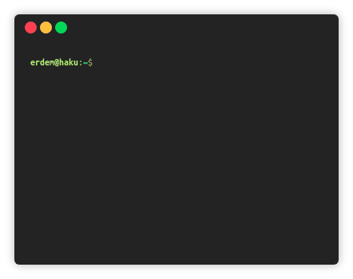

This is a simple CLI quiz game written in Go.

Questions, correct answers and the points awarded for the correct answers are provided via a CSV file formatted like this:

<pre>
5*3,15,1
44+54,98,2
42/7,6,2
</pre>
